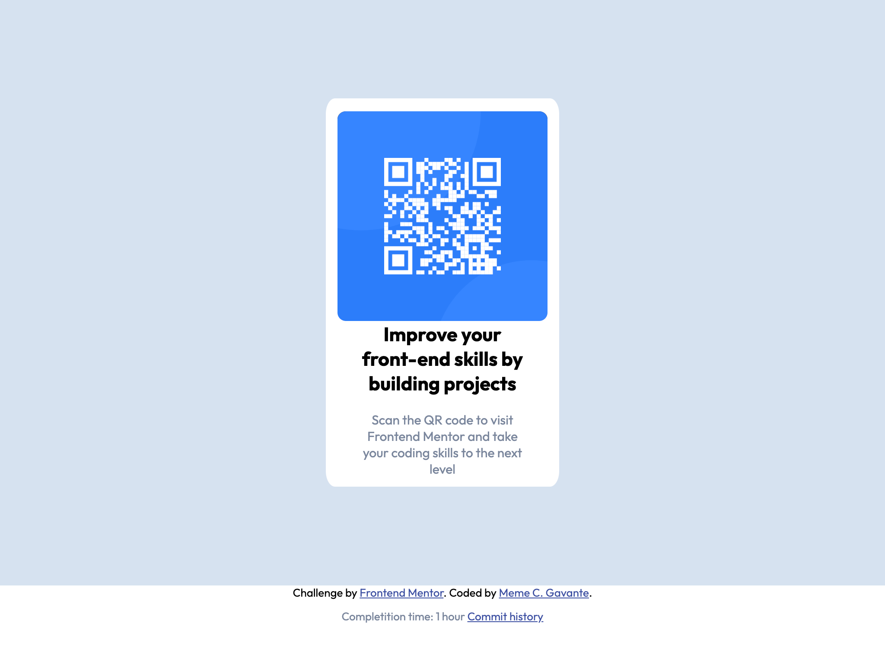

# Frontend Mentor - QR code component solution

This is a solution to the [QR code component challenge on Frontend Mentor](https://www.frontendmentor.io/challenges/qr-code-component-iux_sIO_H). Frontend Mentor challenges help you improve your coding skills by building realistic projects. 

## Table of contents

- [Overview](#overview)
  - [Screenshot](#screenshot)
  - [Links](#links)
- [My process](#my-process)
  - [Built with](#built-with)
## Overview

### Screenshot

Mobile:

Desktop: 

### Links
- Live Site URL: [QR CODE COMPONENT](https://memecgavante.github.io/QR-code-compoent/)
- Commit history: [History](https://github.com/memecgavante/QR-code-compoent/commits/main)

## My process
1. Took a look at the designs and all the files in the template
2. Identify main boxes for the component: The card component, QR_CODE section QR_CODE_INFO section, main section that is basically a container for the card. 
3. Set variables in CSS of the possible repeatable values based on design
4. Update HTML markup to align to the point 2. 
6. Apply styles for fonts, colors. 
5. Start applying styles for positioning and order from Outside the component to inside the component (First body, then main, card, QR_CODE, QR_INFO, IMG, Paragraphs and headers)
6. Test on all possible resolutions
### Built with

- Semantic HTML5 markup
- CSS custom properties
- Flexbox
